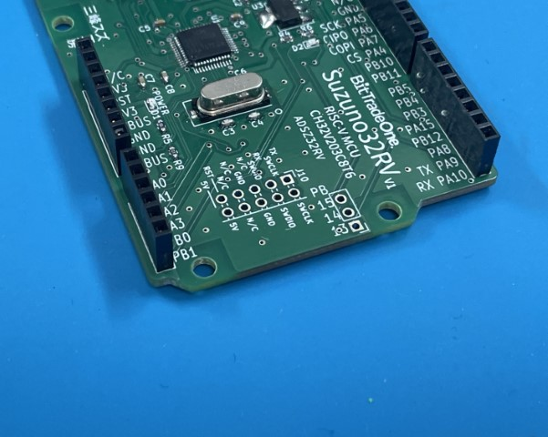

# Suzuno32RV - CH32V203 Prototyping board

**チュートリアル・開発ガイドはこちら → [https://verylowfreq.github.io/suzunodoc/](https://verylowfreq.github.io/suzunodoc/)**

**Suzuno32RV** は **RISC-Vチップ "CH32V"** を搭載した、UNO形状のマイコンボードです。

**CH32V** はWCHによるRISC-Vマイコンです。32ビットRISC-Vコアと、STM32のペリフェラルが実装されていて、小さいながらもパワフルなチップです。

[WCH 32-bit Enhanced Low-Power RISC-V MCU – CH32V203](https://www.wch-ic.com/products/CH32V203.html)

Suzuno32RVはデバイスとしての**Type-Cポート** (USBD) と、ホストとしての**Type-Aポート**（USBFS/USBOTG_FS）が実装されているので、USBデバイス・ホスト機能の開発もできます。

**Suzuno32RV** is a MCU prototyping board with **RISC-V MCU CH32V203C8T6** (LQFP 48pin) in the famous "UNO"-shape board. **CH32V** series is a microprocessor chip of RISC-V by WCH. The chip has RISC-V 32bit CPU core and STM32-like peripherals. The price is cheap but powerful. This board has **Type-C** port (as USB device; USBD) and **Type-A** port (as USB Host; USBFS). So you can develop USB device and/or USB Host program.

## 簡易インストールガイド

**詳細な説明はこちら → [https://verylowfreq.github.io/suzunodoc/](https://verylowfreq.github.io/suzunodoc/)**

◆ 独自コアのインストール : `https://raw.githubusercontent.com/verylowfreq/board_manager_ch32/main/package_ch32v_index_sz.json`

◆ zadigでデバイスドライバの入れ替え

◆ 'CH32V20X' 'Suzuno32RV/SuzuduinoUNO' を選択、アップロード方法は WCH-ISP を選択

## サンプルコード / Sample code

Arduino環境構築はこちらのドキュメントで →  https://verylowfreq.github.io/suzunodoc/

サンプルコード集 → https://github.com/verylowfreq/examples_suzuno32rv

含まれているもの
 - LEDの点滅
 - LEDの複数点灯
 - I2C接続のOLEDの表示
 - SG-90サーボの制御
 - NeoPixelの点灯
 - USBキーボードとして振舞う
 - MIDI入力デバイスとして振舞う
 - WebUSBデバイスとして振舞う

以下はUSBホスト動作のサンプルコードです。いまのところWCH提供のサンプルコードをベースにしていますが、将来的にTinyUSBライブラリを使ったものに差し替える可能性があります。

 - USBホストとして、USBキーボードの入力を読み取る / Act as USB Host and read the key input from USB keyboard
   - https://github.com/verylowfreq/example_suzuno32rv_evt_usbh_read_keyboard
  

 - USBメモリからJPEGファイルを読み込み、SPI接続の液晶画面へ表示する / Load JPEG image files from USB stick and show on SPI LCD
   - このサンプルコードはPlatformIOでの環境構築、ビルドが必要です。
   - https://github.com/verylowfreq/pio_ch32v203_usbms_imageviewer

## 未実装のピンについて（デバッグピン、拡張GPIO）

未実装のピンは自己責任でご利用ください。ピンを実装するとシールドと物理的に干渉する場合があります。

2x5の10ピンは、WCH LinkEデバッガを接続できるデバッグピンです。必須ではありませんが、必要に応じて利用してください。L字のピンヘッダを実装し、リボンケーブルで接続すると便利です。接続方向にご注意ください。

3ピンはPB13,PB14,PB15のGPIOが引き出されています。デバッグピンをリボンケーブルで利用した場合、この3ピンと物理的に干渉する可能性があります。

## 仕様 / Specs

 - CH32V203C8T6
   - RISC-V CPU 144MHz, ROM 64KB, RAM 20KB
 - Digital: 25pins
 - Analog: 6 + more pins
 - USB connector: Type-C, Type-A
 - Program download method: WCH LinkE cable (WCH LinkUtility), USB download (WCHISPStudio)
 - Power supply: Type-C (5V), Pin headers (5V or 3.3V)
 - Crystal: 8MHz (NOTE: CH32V203C8T6 can also run without external crystal)

## Resources / 資料

ビット・トレード・ワン取り扱いの Suzuno32RV (ADSZ32RV) の資料はこちらです。

 - ADSZ32RV 回路図 / Schematic for ADSZ32RV
   - [schematic_suzuno32rv_v1_bto.pdf](https://github.com/verylowfreq/board_suzuno32rv/blob/main/schematic_suzuno32rv_v1_bto.pdf)

以下は限定的に配布された先行版基板の資料です。

 - 簡易説明書 / Short guide
   - [suzuno32rv_shortguide_1.pdf](https://github.com/verylowfreq/board_suzuno32rv/blob/main/suzuno32rv_shortguide_1.pdf)
 - 回路図 / Schematic
   - [schematic_suzuno32rv_v1.pdf](https://github.com/verylowfreq/board_suzuno32rv/blob/main/schematic_suzuno32rv_v1.pdf)

## 関連する基板 / Related-board

わたしは "Suzuduino UNO" というボードも製作・頒布しています。これは手ハンダ実装に適した基板で、CH32V203K8T6 (LQFP 32pin) を採用したものです。

I also made "Suzuduino UNO" as former board. This board uses CH32V203K8T6 (LQFP 32pin) and good for hand soldering.

https://github.com/verylowfreq/suzuduino-uno-v1/
